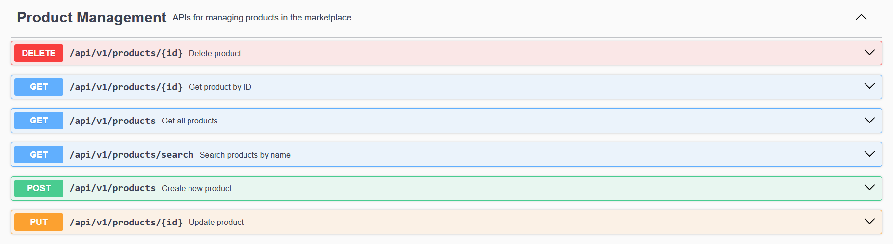
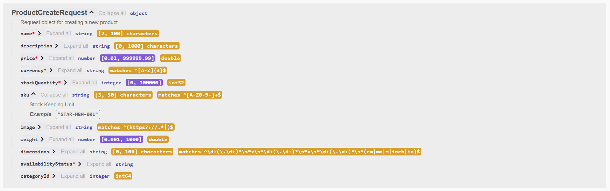
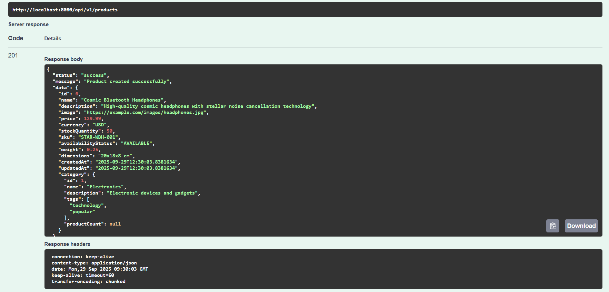

# Meow, meow, meow :3

## Progress so far

- [x] [API Contract for Product Entity (CRUD)](src/main/java/net/cosmocat/marketplace/controller/ProductController.java)
- [x] [OpenAPI documentation](src/main/resources/static/api-docs.json)
- [x] Info about DTOs fields, validation requirements
- [x] [Global Exceptions Handler & @ControllerAdvice](src/main/java/net/cosmocat/marketplace/exception/GlobalExceptionHandler.java)
- [x] [Basic domain entities](src/main/java/net/cosmocat/marketplace/database/entity/Product.java)
- [x] [Basic DTOs for entities](src/main/java/net/cosmocat/marketplace/database/dto/entity/ProductDTO.java)
- [x] [Entity <-> DTO mapping via MapStruct](src/main/java/net/cosmocat/marketplace/mapper/ProductMapper.java)
- [x] [CRUD operations for Product entity](src/main/java/net/cosmocat/marketplace/database/dal/service/ProductService.java)
- [x] [Validation, validations, custom validator](src/main/java/net/cosmocat/marketplace/validation/CosmicWordCheckValidator.java)

## Images so far

